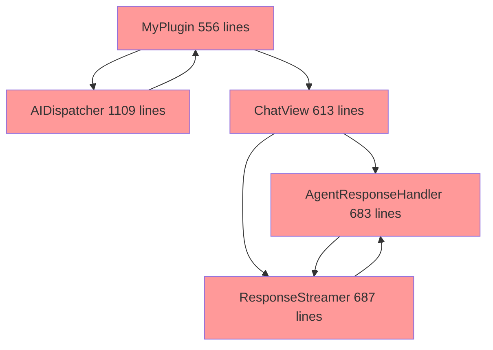
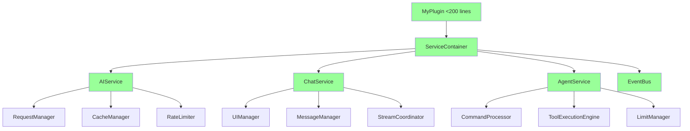

# Comprehensive Architecture Refactoring Plan

## Executive Summary

This plan addresses the three critical architectural issues identified in the review:
1. **Large Classes** - Break down 5 major classes (1,109-556 lines) into focused, single-responsibility components
2. **Dependency Injection** - Implement proper DI to resolve circular dependencies and improve testability  
3. **Component Coupling** - Reduce interdependencies through service abstractions and event-driven architecture

## Current Architecture Problems

Based on analysis, the main issues are:

**Monolithic Classes:**
- [`AIDispatcher`](../src/utils/aiDispatcher.ts) (1,109 lines) - Handles requests, caching, rate limiting, metrics, circuit breakers
- [`ChatView`](../src/chat.ts) (613 lines) - UI management, event handling, message processing, streaming
- [`AgentResponseHandler`](../src/components/agent/AgentResponseHandler/AgentResponseHandler.ts) (683 lines) - Tool parsing, execution, display management
- [`ResponseStreamer`](../src/components/chat/ResponseStreamer.ts) (687 lines) - Streaming, agent processing, task continuation
- [`MyPlugin`](../src/main.ts) (556 lines) - Initialization, view management, command registration

**Circular Dependencies:**
- Main plugin → AIDispatcher → Plugin settings
- ChatView → AgentResponseHandler → ChatView callbacks
- ResponseStreamer → AgentResponseHandler → ResponseStreamer methods

**Tight Coupling:**
- Direct instantiation throughout the codebase
- Hard-coded dependencies in constructors
- Shared mutable state across components

## Phase 1: Architecture Foundation Setup

### 1.1 Enhanced Dependency Injection System

**Current State:** Basic [`ServiceLocator`](../src/utils/dependencyInjection.ts) exists but underutilized

**Target Architecture:**
```typescript
// Core DI Container
interface IServiceContainer {
  register<T>(token: string, factory: () => T, scope?: 'singleton' | 'transient'): void;
  resolve<T>(token: string): T;
  createScope(): IServiceScope;
}

// Service Registration
interface IServiceRegistry {
  registerCoreServices(): void;
  registerChatServices(): void;
  registerAgentServices(): void;
  registerUIServices(): void;
}
```

**Implementation Strategy:**
- Extend existing [`DIContainer`](../src/utils/dependencyInjection.ts) with lifecycle management
- Create service interfaces for all major components
- Implement factory pattern for complex object creation
- Add scope management for request-level services

### 1.2 Event Bus System

**Purpose:** Decouple components through event-driven communication

```typescript
interface IEventBus {
  publish<T>(event: string, data: T): void;
  subscribe<T>(event: string, handler: (data: T) => void): () => void;
  subscribeOnce<T>(event: string, handler: (data: T) => void): void;
}

// Event Types
interface ChatEvents {
  'message.sent': { content: string; role: 'user' | 'assistant' };
  'stream.started': { streamId: string };
  'stream.chunk': { streamId: string; chunk: string };
  'stream.completed': { streamId: string; content: string };
  'tool.executed': { command: ToolCommand; result: ToolResult };
}
```

### 1.3 Service Layer Abstractions

**Core Service Interfaces:**
```typescript
interface IAIService {
  getCompletion(request: CompletionRequest): Promise<CompletionResponse>;
  testConnection(provider: string): Promise<ConnectionResult>;
  getAvailableModels(provider: string): Promise<string[]>;
}

interface IChatService {
  sendMessage(content: string): Promise<void>;
  regenerateMessage(messageId: string): Promise<void>;
  clearHistory(): Promise<void>;
}

interface IAgentService {
  processResponse(response: string): Promise<AgentResult>;
  executeTools(commands: ToolCommand[]): Promise<ToolResult[]>;
  isLimitReached(): boolean;
}
```

## Phase 2: Core Infrastructure Refactoring

### 2.1 AIDispatcher Decomposition

**Current Issues:** Single class handling 8 different responsibilities

**Refactoring Strategy:**
```typescript
// Request Management
interface IRequestManager {
  queueRequest(request: AIRequest): Promise<void>;
  processQueue(): Promise<void>;
  getQueueStatus(): QueueStatus;
}

// Caching Layer  
interface ICacheManager {
  get(key: string): Promise<string | null>;
  set(key: string, value: string, ttl?: number): Promise<void>;
  clear(): Promise<void>;
}

// Rate Limiting
interface IRateLimiter {
  checkLimit(provider: string): boolean;
  recordRequest(provider: string): void;
  getRemainingRequests(provider: string): number;
}

// Circuit Breaker
interface ICircuitBreaker {
  isOpen(provider: string): boolean;
  recordSuccess(provider: string): void;
  recordFailure(provider: string): void;
}

// Metrics Collection
interface IMetricsCollector {
  recordRequest(provider: string, duration: number): void;
  getMetrics(): RequestMetrics;
  resetMetrics(): void;
}
```

**New AIDispatcher Structure:**
```typescript
class AIDispatcher {
  constructor(
    private requestManager: IRequestManager,
    private cacheManager: ICacheManager,
    private rateLimiter: IRateLimiter,
    private circuitBreaker: ICircuitBreaker,
    private metricsCollector: IMetricsCollector,
    private providerFactory: IProviderFactory
  ) {}

  async getCompletion(request: CompletionRequest): Promise<void> {
    // Orchestrate the services, not implement the logic
  }
}
```

### 2.2 Main Plugin Refactoring

**Current Issues:** 556 lines handling initialization, view management, commands, settings

**Refactoring Strategy:**
```typescript
// Initialization Manager
interface IInitializationManager {
  initializeCore(): Promise<void>;
  initializeViews(): Promise<void>;
  initializeCommands(): Promise<void>;
  cleanup(): Promise<void>;
}

// View Manager
interface IViewManager {
  registerViews(): void;
  activateView(type: string): Promise<void>;
  getActiveViews(): ViewInfo[];
}

// Command Manager  
interface ICommandManager {
  registerCommands(): void;
  unregisterCommands(): void;
  executeCommand(id: string, ...args: any[]): Promise<void>;
}

// Settings Manager
interface ISettingsManager {
  loadSettings(): Promise<MyPluginSettings>;
  saveSettings(settings: MyPluginSettings): Promise<void>;
  onSettingsChange(callback: () => void): () => void;
}
```

**New Main Plugin Structure:**
```typescript
export default class MyPlugin extends Plugin {
  constructor(
    private container: IServiceContainer,
    private initManager: IInitializationManager,
    private viewManager: IViewManager,
    private commandManager: ICommandManager,
    private settingsManager: ISettingsManager
  ) {}

  async onload() {
    await this.initManager.initializeCore();
    await this.initManager.initializeViews();
    await this.initManager.initializeCommands();
  }
}
```

## Phase 3: Chat System Decomposition

### 3.1 ChatView Breakdown

**Current Issues:** 613 lines handling UI, events, streaming, agent integration

**Refactoring Strategy:**
```typescript
// UI Management
interface IChatUIManager {
  createChatInterface(): HTMLElement;
  updateMessageDisplay(message: Message): void;
  scrollToBottom(): void;
  showTypingIndicator(): void;
}

// Event Coordination
interface IChatEventCoordinator {
  setupEventHandlers(): void;
  handleSendMessage(content: string): Promise<void>;
  handleStopStream(): void;
  handleClearChat(): void;
}

// Message Management
interface IMessageManager {
  addMessage(message: Message): Promise<void>;
  regenerateMessage(messageId: string): Promise<void>;
  getMessageHistory(): Message[];
}

// Stream Coordination
interface IStreamCoordinator {
  startStream(messages: Message[]): Promise<string>;
  stopStream(): void;
  isStreaming(): boolean;
}
```

**New ChatView Structure:**
```typescript
export class ChatView extends ItemView {
  constructor(
    leaf: WorkspaceLeaf,
    private uiManager: IChatUIManager,
    private eventCoordinator: IChatEventCoordinator,
    private messageManager: IMessageManager,
    private streamCoordinator: IStreamCoordinator
  ) {}

  async onOpen() {
    const ui = this.uiManager.createChatInterface();
    this.contentEl.appendChild(ui);
    this.eventCoordinator.setupEventHandlers();
  }
}
```

### 3.2 ResponseStreamer Pipeline

**Current Issues:** 687 lines handling streaming, agent processing, continuation

**Refactoring Strategy:**
```typescript
// Streaming Pipeline
interface IStreamingPipeline {
  process(request: StreamRequest): AsyncIterator<StreamChunk>;
}

// Agent Integration
interface IAgentIntegrator {
  processResponse(response: string): Promise<AgentResult>;
  shouldContinue(result: AgentResult): boolean;
}

// Task Continuation
interface ITaskContinuationManager {
  canContinue(context: TaskContext): boolean;
  continueTask(context: TaskContext): Promise<ContinuationResult>;
  handleLimitReached(context: TaskContext): void;
}

// UI Updates
interface IStreamUIUpdater {
  updateContent(container: HTMLElement, content: string): void;
  showToolResults(container: HTMLElement, results: ToolResult[]): void;
  showContinuationOptions(container: HTMLElement): void;
}
```

## Phase 4: Agent System Restructuring

### 4.1 AgentResponseHandler Decomposition

**Current Issues:** 683 lines handling parsing, execution, display, limits

**Refactoring Strategy:**
```typescript
// Command Processing
interface ICommandProcessor {
  parseCommands(response: string): ToolCommand[];
  validateCommands(commands: ToolCommand[]): ValidationResult;
  filterExecutedCommands(commands: ToolCommand[], history: any[]): ToolCommand[];
}

// Tool Execution
interface IToolExecutionEngine {
  executeCommand(command: ToolCommand): Promise<ToolResult>;
  canExecute(command: ToolCommand): boolean;
  getExecutionStats(): ExecutionStats;
}

// Limit Management
interface IExecutionLimitManager {
  isLimitReached(): boolean;
  canExecute(count: number): boolean;
  addExecutions(count: number): void;
  resetLimit(): void;
}

// Display Management
interface IToolDisplayManager {
  createDisplay(command: ToolCommand, result: ToolResult): ToolRichDisplay;
  updateDisplay(displayId: string, result: ToolResult): void;
  getDisplays(): Map<string, ToolRichDisplay>;
}
```

### 4.2 Tool Execution Pipeline

**Implementation Strategy:**
```typescript
// Command Pattern for Tool Execution
interface IToolCommand {
  execute(): Promise<ToolResult>;
  canExecute(): boolean;
  getMetadata(): ToolMetadata;
}

// Pipeline Stages
interface IToolPipeline {
  addStage(stage: IToolPipelineStage): void;
  process(command: ToolCommand): Promise<ToolResult>;
}

interface IToolPipelineStage {
  process(command: ToolCommand, context: PipelineContext): Promise<PipelineResult>;
}

// Stages: Validation → Execution → Display → Notification
```

## Phase 5: Cross-Cutting Concerns

### 5.1 Error Handling Boundaries

**Strategy:** Implement error boundaries at service layer boundaries

```typescript
interface IErrorBoundary {
  wrap<T>(operation: () => Promise<T>): Promise<T>;
  handleError(error: Error, context: ErrorContext): void;
}

// Service-level error handling
class ServiceErrorBoundary implements IErrorBoundary {
  async wrap<T>(operation: () => Promise<T>): Promise<T> {
    try {
      return await operation();
    } catch (error) {
      this.handleError(error, { service: 'chat', operation: 'sendMessage' });
      throw new ServiceError('Chat service unavailable', error);
    }
  }
}
```

### 5.2 Configuration Management

**Strategy:** Centralize configuration with reactive updates

```typescript
interface IConfigurationManager {
  get<T>(key: string): T;
  set<T>(key: string, value: T): Promise<void>;
  subscribe(key: string, callback: (value: any) => void): () => void;
  validate(config: Partial<MyPluginSettings>): ValidationResult;
}
```

## Phase 6: Integration Strategy

### 6.1 Migration Approach

**Strategy:** Incremental migration with feature flags

1. **Service Registration Phase**
   - Register new services alongside existing code
   - Use feature flags to switch between old/new implementations

2. **Component Migration Phase**
   - Migrate one component at a time
   - Maintain backward compatibility during transition

3. **Integration Phase**
   - Remove old implementations
   - Clean up temporary migration code

### 6.2 Testing Strategy

**Unit Testing:**
- Test each service in isolation with mocked dependencies
- Focus on business logic separation from infrastructure

**Integration Testing:**
- Test service interactions through the DI container
- Verify event bus communication patterns

**Performance Testing:**
- Measure memory usage improvements from reduced coupling
- Validate response time improvements from better caching

## Implementation Timeline

**Week 1-2:** Phase 1 & 2 - Foundation and Core Infrastructure
**Week 3-4:** Phase 3 & 4 - Chat and Agent System Refactoring  
**Week 5-6:** Phase 5 & 6 - Cross-cutting Concerns and Integration

## Success Metrics

**Maintainability:**
- Reduce average class size from 700+ lines to <200 lines
- Achieve >80% test coverage for new architecture
- Eliminate circular dependencies

**Performance:**
- Maintain or improve response times
- Reduce memory usage through better object lifecycle management
- Improve startup time through lazy loading

**Developer Experience:**
- Enable independent development of components
- Simplify debugging through clear service boundaries
- Facilitate easier feature additions

## Mermaid Diagrams

### Current Architecture Problems


### Target Architecture


This comprehensive plan addresses all three major architectural concerns while preserving the excellent functionality that already exists. The phased approach ensures minimal disruption while systematically improving the codebase's maintainability and extensibility.