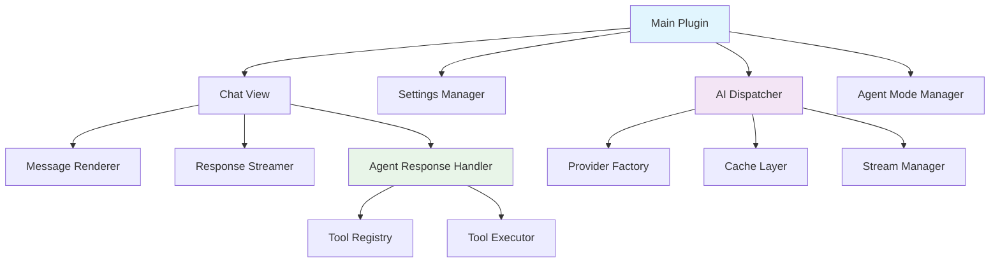

# Comprehensive Code Review Plan for AI Assistant for Obsidian Plugin

## Overview

This document outlines a comprehensive code review plan for the AI Assistant for Obsidian plugin, covering architecture, security, performance, functionality, and code quality aspects.

## Plugin Summary

The AI Assistant for Obsidian is a sophisticated plugin that provides:
- Multi-provider AI integration (OpenAI, Anthropic, Gemini, Ollama)
- Advanced chat interface with streaming responses
- Agent mode with tool execution capabilities
- Comprehensive file operations and vault management
- Advanced optimization features (object pooling, caching, dependency injection)

## 1. Architecture & Design Patterns Review

### 1.1 Overall Architecture Assessment
- **Plugin Structure**: Evaluate the modular design with clear separation between core (`main.ts`), UI (`chat.ts`), utilities, and components
- **Provider Pattern**: Review the AI provider abstraction system for extensibility and maintainability
- **Dependency Management**: Analyze the new dependency injection system (`Priority3IntegrationManager`)
- **Event-Driven Architecture**: Assess the event handling and lifecycle management

### 1.2 Design Pattern Analysis

**Patterns to Review:**
- **Factory Pattern**: Provider creation and tool instantiation
- **Observer Pattern**: Settings change notifications and event handling
- **Strategy Pattern**: Different AI providers and tool execution strategies
- **Singleton Pattern**: Object pools and state managers
- **Command Pattern**: Tool execution system

### 1.3 Modularity & Coupling
- Assess inter-module dependencies and coupling levels
- Review interface definitions and abstraction boundaries
- Evaluate code reusability and extensibility

## 2. Security Analysis

### 2.1 API Key & Credential Management
- **Storage Security**: Review how API keys are stored in Obsidian settings
- **Transmission Security**: Analyze HTTPS usage and request security
- **Key Exposure**: Check for potential key leakage in logs or error messages
- **Sanitization**: Review the error message sanitization in `errorHandler.ts`

### 2.2 Input Validation & Sanitization
- **Message Validation**: Review the `validateRequest()` method in `AIDispatcher`
- **Path Validation**: Analyze the `PathValidator` class for file operations
- **Tool Parameter Validation**: Check tool input sanitization
- **XSS Prevention**: Review HTML content rendering and markdown processing

### 2.3 File System Security
- **Path Traversal**: Analyze file operation tools for directory traversal vulnerabilities
- **Permission Checks**: Review file access controls and vault boundaries
- **Backup Security**: Assess backup file handling and storage

## 3. Performance Optimization Review

### 3.1 Memory Management
- **Object Pooling**: Review `MessageContextPool` and `PreAllocatedArrays` implementation
- **Memory Leaks**: Analyze event listener cleanup and resource disposal
- **Cache Management**: Evaluate LRU cache implementation and memory usage
- **DOM Management**: Review DOM element caching and cleanup

### 3.2 Caching Strategy
- **Response Caching**: Analyze the multi-level caching in `AIDispatcher`
- **Cache Invalidation**: Review TTL and cache cleanup mechanisms
- **Cache Key Generation**: Assess the Unicode-safe cache key generation
- **Model Caching**: Evaluate provider model caching strategy

### 3.3 Streaming & Concurrency
- **Stream Management**: Review the centralized stream management system
- **Concurrent Requests**: Analyze request queuing and rate limiting
- **Circuit Breaker**: Evaluate the circuit breaker implementation
- **Async Optimization**: Review the `AsyncOptimizer` and batching systems

## 4. Functionality & Feature Review

### 4.1 AI Integration
- **Multi-Provider Support**: Review OpenAI, Anthropic, Gemini, and Ollama integrations
- **Model Management**: Analyze model selection and availability checking
- **Request/Response Handling**: Review streaming and non-streaming responses
- **Error Recovery**: Assess retry logic and fallback mechanisms

### 4.2 Agent Mode & Tools
- **Tool System**: Review the tool registry and execution framework
- **Agent Response Handling**: Analyze the sophisticated agent response processing
- **Tool Limit Management**: Review the tool execution limits and warnings
- **File Operations**: Assess the comprehensive file manipulation tools

### 4.3 Chat Interface
- **UI Components**: Review the modular chat UI implementation
- **Message Rendering**: Analyze markdown rendering and tool display
- **History Management**: Review chat persistence and session management
- **User Experience**: Assess keyboard shortcuts, commands, and accessibility

## 5. Code Quality Assessment

### 5.1 TypeScript Usage
- **Type Safety**: Review interface definitions and type coverage
- **Generic Usage**: Analyze generic implementations in utilities
- **Type Guards**: Review the type guard functions in `typeguards.ts`
- **Error Handling**: Assess typed error handling patterns

### 5.2 Error Handling & Logging
- **Centralized Error Handling**: Review the `ErrorHandler` singleton implementation
- **Logging Strategy**: Analyze the debug logging system
- **Error Recovery**: Assess graceful degradation and user feedback
- **Error Tracking**: Review error frequency tracking and circuit breakers

### 5.3 Code Organization
- **File Structure**: Evaluate the logical organization of components
- **Naming Conventions**: Review consistency in naming and conventions
- **Documentation**: Assess inline documentation and JSDoc usage
- **Code Duplication**: Identify potential refactoring opportunities

## 6. Testing & Maintainability

### 6.1 Testability
- **Dependency Injection**: Review the new DI system for testing
- **Mock Points**: Identify areas suitable for unit testing
- **Integration Points**: Assess API integration testing needs
- **Error Simulation**: Review error handling test scenarios

### 6.2 Configuration Management
- **Settings Structure**: Review the comprehensive settings system
- **Default Values**: Analyze default configuration and validation
- **Migration Strategy**: Assess settings upgrade and compatibility
- **Environment Handling**: Review development vs production configurations

## 7. Specific Technical Deep Dives

### 7.1 Priority Optimizations Analysis
- **Priority 1**: Request deduplication and memory optimization
- **Priority 2**: LRU caching and async optimization  
- **Priority 3**: Dependency injection and state management
- **Performance Impact**: Measure optimization effectiveness

### 7.2 Advanced Features Review
- **YAML Generation**: Review the YAML attribute generation system
- **Backup Management**: Analyze the backup and restore functionality
- **Command System**: Review the comprehensive command registration
- **Integration Points**: Assess Obsidian API usage and best practices

## 8. Key Files to Review

### Core Architecture
- `src/main.ts` - Main plugin entry point
- `src/chat.ts` - Chat view implementation
- `src/utils/aiDispatcher.ts` - Central AI request handling
- `src/types/` - Type definitions and interfaces

### Security & Validation
- `src/utils/errorHandler.ts` - Error handling and sanitization
- `src/components/chat/agent/tools/pathValidation.ts` - Path validation
- `src/settings/` - Settings management and validation

### Performance & Optimization
- `src/utils/objectPool.ts` - Memory optimization
- `src/utils/lruCache.ts` - Caching implementation
- `src/utils/streamManager.ts` - Stream management
- `src/utils/asyncOptimizer.ts` - Async optimizations

### Agent & Tools
- `src/components/chat/agent/` - Agent mode implementation
- `src/components/chat/agent/tools/` - Tool implementations
- `src/components/chat/agent/AgentResponseHandler/` - Response handling

## 9. Review Methodology

### Phase 1: Static Analysis
1. Code structure and organization review
2. Type safety and interface analysis
3. Security vulnerability scanning
4. Performance bottleneck identification

### Phase 2: Dynamic Analysis
1. Memory usage patterns
2. Error handling scenarios
3. Concurrency and race conditions
4. User experience flows

### Phase 3: Integration Review
1. Obsidian API usage compliance
2. Provider integration robustness
3. File system operation safety
4. Cross-component communication

## 10. Expected Deliverables

### Critical Issues Report
- Security vulnerabilities requiring immediate attention
- Performance bottlenecks affecting user experience
- Architectural flaws impacting maintainability

### Improvement Recommendations
- Code quality enhancements
- Performance optimization opportunities
- Security hardening suggestions
- Maintainability improvements

### Best Practices Assessment
- Obsidian plugin development standards compliance
- TypeScript best practices adherence
- Error handling pattern consistency
- Documentation completeness

### Future Considerations
- Scalability planning
- Extensibility roadmap
- Testing strategy recommendations
- Monitoring and observability suggestions

---

*This review plan provides a comprehensive framework for evaluating all aspects of the AI Assistant plugin codebase, ensuring thorough coverage of architecture, security, performance, functionality, and code quality concerns.*