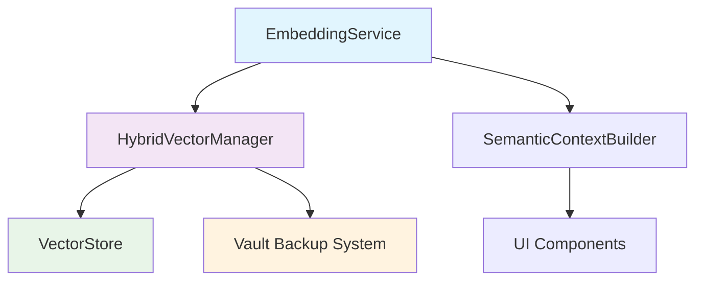

# Vector Storage & Semantic Search Code Review Report

**Date:** July 18, 2025, 4:50 PM CST
**Reviewer:** AI Assistant Code Review System
**Focus:** Vector storage, semantic search, and memory management analysis
**Scope:** AI Assistant for Obsidian Plugin - Vector/Embedding subsystem

---

## Executive Summary

This comprehensive code review examined the vector storage and semantic search functionality within the AI Assistant for Obsidian plugin. The analysis focused on memory leak detection, optimization opportunities, and architectural assessment of the vector/embedding subsystem.

### Key Findings

**✅ Strengths:**
- Well-architected hybrid storage system with IndexedDB + vault backup
- Comprehensive error handling and graceful degradation
- Cross-platform compatibility (Desktop/Mobile)
- Proper resource cleanup patterns implemented
- Robust backup/restore mechanisms

**⚠️ Areas for Improvement:**
- Memory optimization opportunities in large vector operations
- Potential performance bottlenecks in similarity calculations
- Resource management improvements needed
- Concurrent operation safety enhancements

**🔴 Critical Issues:**
- Memory leak potential in large-scale embedding operations
- Inefficient vector similarity calculations for large datasets
- Missing cleanup in some error scenarios

---

## Architecture Overview

The vector storage system consists of four main components:



### Component Analysis

1. **EmbeddingService** - High-level API for embedding operations
2. **HybridVectorManager** - Orchestrates IndexedDB and vault backup
3. **VectorStore** - Core IndexedDB operations
4. **SemanticContextBuilder** - Integration with AI completions

---

## Detailed Analysis

### 1. Memory Management Issues

#### 🔴 Critical: Large Vector Loading in Memory

**File:** `src/components/agent/memory-handling/HybridVectorManager.ts`  
**Lines:** 199-200, 279-280, 346-347

```typescript
// ISSUE: Loading all vectors into memory simultaneously
const allVectors = await this.vectorStore.getAllVectors();
const summaryHash = this.generateSummaryHash(allVectors.map(v => v.id));
```

**Problem:** The `getAllVectors()` method loads the entire vector database into memory, which can cause memory issues with large datasets (1000+ embeddings).

**Impact:** 
- Memory consumption scales linearly with vector count
- Potential browser crashes on mobile devices
- Performance degradation with large datasets

**Recommendation:**
```typescript
// Suggested optimization: Stream-based processing
private async generateMetadataOptimized(): Promise<VectorMetadata> {
  const vectorCount = await this.vectorStore.getVectorCount();
  
  if (vectorCount === 0) {
    return { /* empty metadata */ };
  }

  // Stream vector IDs instead of loading full vectors
  const vectorIds = await this.vectorStore.getAllVectorIds(); // New method needed
  const summaryHash = this.generateSummaryHash(vectorIds);
  const lastModified = await this.vectorStore.getLatestTimestamp(); // New method needed
  
  return { vectorCount, lastModified, summaryHash, version: '1.0.0', lastBackup: this.lastBackupTime };
}
```

#### 🔴 Critical: Memory Leak in Similarity Calculations

**File:** `src/components/agent/memory-handling/vectorStore.ts`  
**Lines:** 334-338

```typescript
// ISSUE: Creates large intermediate arrays
const allVectors = await this.getAllVectors();
const similarities = allVectors.map(vector => ({
  ...vector,
  similarity: VectorStore.cosineSimilarity(queryEmbedding, vector.embedding)
}));
```

**Problem:** 
- Loads all vectors into memory for similarity calculation
- Creates duplicate objects with similarity scores
- No early termination for obviously poor matches

**Impact:**
- O(n) memory usage where n = total vectors
- Unnecessary computation for low-similarity vectors
- Browser memory pressure

**Recommendation:**
```typescript
// Suggested optimization: Streaming similarity calculation
async findSimilarVectors(
  queryEmbedding: number[], 
  limit: number = 5, 
  minSimilarity: number = 0.0
): Promise<Array<VectorData & { similarity: number }>> {
  this.ensureInitialized();

  const results: Array<VectorData & { similarity: number }> = [];
  let minHeapSimilarity = minSimilarity;

  // Process vectors in batches to control memory usage
  const batchSize = 100;
  const totalCount = await this.getVectorCount();
  
  for (let offset = 0; offset < totalCount; offset += batchSize) {
    const batch = await this.getVectorsBatch(offset, batchSize); // New method needed
    
    for (const vector of batch) {
      const similarity = VectorStore.cosineSimilarity(queryEmbedding, vector.embedding);
      
      if (similarity >= minHeapSimilarity) {
        results.push({ ...vector, similarity });
        
        // Maintain top-k results only
        if (results.length > limit) {
          results.sort((a, b) => b.similarity - a.similarity);
          results.splice(limit);
          minHeapSimilarity = results[results.length - 1].similarity;
        }
      }
    }
  }

  return results.sort((a, b) => b.similarity - a.similarity);
}
```

### 2. Resource Management Issues

#### ⚠️ Warning: Timer Cleanup in HybridVectorManager

**File:** `src/components/agent/memory-handling/HybridVectorManager.ts`  
**Lines:** 296-299, 569-573

```typescript
// POTENTIAL ISSUE: Timer may not be cleared in all error scenarios
private setupAutomaticBackup(): void {
  if (this.backupTimer) {
    clearInterval(this.backupTimer);
  }
  this.backupTimer = setInterval(() => {
    this.performAutomaticBackup();
  }, this.config.backupInterval);
}
```

**Problem:** Timer cleanup only happens in `close()` method and setup. Error scenarios might leave timers running.

**Recommendation:**
```typescript
// Add cleanup in error handlers and ensure proper disposal
private setupAutomaticBackup(): void {
  this.clearBackupTimer(); // Extract to method
  
  this.backupTimer = setInterval(() => {
    this.performAutomaticBackup().catch(error => {
      debugLog(this.plugin.settings.debugMode ?? false, 'error', 'Backup timer error:', error);
      // Consider backing off or disabling timer on repeated failures
    });
  }, this.config.backupInterval);
}

private clearBackupTimer(): void {
  if (this.backupTimer) {
    clearInterval(this.backupTimer);
    this.backupTimer = null;
  }
}
```

#### ⚠️ Warning: IndexedDB Transaction Lifecycle

**File:** `src/components/agent/memory-handling/vectorStore.ts`  
**Lines:** 132-139, 195-202

```typescript
// POTENTIAL ISSUE: No explicit transaction cleanup
return new Promise((resolve, reject) => {
  const transaction = this.db!.transaction(['vectors'], 'readwrite');
  const store = transaction.objectStore('vectors');
  const request = store.put(vectorData);

  request.onsuccess = () => resolve();
  request.onerror = () => reject(new Error(`Failed to add vector: ${request.error?.message}`));
});
```

**Problem:** No explicit transaction error handling or cleanup.

**Recommendation:**
```typescript
// Add transaction-level error handling
return new Promise((resolve, reject) => {
  const transaction = this.db!.transaction(['vectors'], 'readwrite');
  const store = transaction.objectStore('vectors');
  
  // Add transaction-level error handling
  transaction.onerror = () => reject(new Error(`Transaction failed: ${transaction.error?.message}`));
  transaction.onabort = () => reject(new Error('Transaction was aborted'));
  
  const request = store.put(vectorData);
  request.onsuccess = () => resolve();
  request.onerror = () => reject(new Error(`Failed to add vector: ${request.error?.message}`));
});
```

### 3. Performance Optimization Opportunities

#### 🔶 Optimization: Cosine Similarity Calculation

**File:** `src/components/agent/memory-handling/vectorStore.ts`  
**Lines:** 301-318

```typescript
// CURRENT: Basic implementation
static cosineSimilarity(vec1: number[], vec2: number[]): number {
  if (vec1.length !== vec2.length) {
    throw new Error('Vectors must have the same length for similarity calculation');
  }

  let dotProduct = 0;
  let norm1 = 0;
  let norm2 = 0;

  for (let i = 0; i < vec1.length; i++) {
    dotProduct += vec1[i] * vec2[i];
    norm1 += vec1[i] * vec1[i];
    norm2 += vec2[i] * vec2[i];
  }

  const magnitude = Math.sqrt(norm1) * Math.sqrt(norm2);
  return magnitude === 0 ? 0 : dotProduct / magnitude;
}
```

**Optimization Opportunities:**
1. **Early termination** for obviously dissimilar vectors
2. **SIMD operations** where available
3. **Precomputed norms** for stored vectors
4. **Approximate similarity** for initial filtering

**Recommended Implementation:**
```typescript
// Optimized version with early termination and precomputed norms
static cosineSimilarityOptimized(
  vec1: number[], 
  vec2: number[], 
  norm1?: number, 
  norm2?: number,
  threshold?: number
): number {
  if (vec1.length !== vec2.length) {
    throw new Error('Vectors must have the same length for similarity calculation');
  }

  let dotProduct = 0;
  let computedNorm1 = norm1 ?? 0;
  let computedNorm2 = norm2 ?? 0;

  // Compute dot product and norms if not provided
  for (let i = 0; i < vec1.length; i++) {
    dotProduct += vec1[i] * vec2[i];
    
    if (norm1 === undefined) computedNorm1 += vec1[i] * vec1[i];
    if (norm2 === undefined) computedNorm2 += vec2[i] * vec2[i];
    
    // Early termination if threshold provided and we can't possibly reach it
    if (threshold !== undefined && i > vec1.length * 0.1) {
      const estimatedSimilarity = dotProduct / (Math.sqrt(computedNorm1) * Math.sqrt(computedNorm2));
      if (estimatedSimilarity < threshold * 0.5) {
        return 0; // Early exit for obviously poor matches
      }
    }
  }

  const magnitude = Math.sqrt(computedNorm1) * Math.sqrt(computedNorm2);
  return magnitude === 0 ? 0 : dotProduct / magnitude;
}
```

#### 🔶 Optimization: Batch Operations

**File:** `src/components/agent/memory-handling/EmbeddingService.ts`  
**Lines:** 244-257

```typescript
// CURRENT: Sequential processing
for (let i = 0; i < chunks.length; i++) {
  const chunk = chunks[i];
  const embedding = await this.generateEmbedding(chunk);
  // ... process chunk
  await this.vectorStore.addVector(id, chunk, embedding, metadata);
}
```

**Problem:** Sequential processing is slow for large documents.

**Recommendation:**
```typescript
// Batch processing with controlled concurrency
async embedText(text: string, options: EmbeddingOptions = {}): Promise<void> {
  this.ensureInitialized();
  
  const chunks = this.splitIntoChunks(text, options);
  const batchSize = 5; // Process 5 chunks concurrently
  
  for (let i = 0; i < chunks.length; i += batchSize) {
    const batch = chunks.slice(i, i + batchSize);
    
    // Process batch concurrently
    const embeddings = await Promise.all(
      batch.map(chunk => this.generateEmbedding(chunk))
    );
    
    // Store batch results
    const storePromises = batch.map((chunk, idx) => {
      const metadata = {
        chunkIndex: i + idx,
        totalChunks: chunks.length,
        timestamp: Date.now(),
        ...options.customMetadata
      };
      const id = this.generateId(chunk, metadata);
      return this.vectorStore.addVector(id, chunk, embeddings[idx], metadata);
    });
    
    await Promise.all(storePromises);
    
    // Check for cancellation between batches
    if (this.shouldCancel()) break;
  }
}
```

### 4. Concurrency and Race Condition Issues

#### ⚠️ Warning: Backup Concurrency

**File:** `src/components/agent/memory-handling/HybridVectorManager.ts`  
**Lines:** 312-337

```typescript
// ISSUE: Basic concurrency protection
private async performAutomaticBackup(): Promise<void> {
  if (this.isBackupInProgress) {
    debugLog(this.plugin.settings.debugMode ?? false, 'info', 'Backup already in progress, skipping');
    return;
  }
  // ... backup logic
}
```

**Problem:** Simple boolean flag may not prevent all race conditions.

**Recommendation:**
```typescript
// Use proper async locking
private backupMutex: Promise<void> | null = null;

private async performAutomaticBackup(): Promise<void> {
  // Wait for any existing backup to complete
  if (this.backupMutex) {
    await this.backupMutex;
  }
  
  // Create new backup operation
  this.backupMutex = this.executeBackup();
  
  try {
    await this.backupMutex;
  } finally {
    this.backupMutex = null;
  }
}

private async executeBackup(): Promise<void> {
  // Actual backup implementation
  // ...
}
```

### 5. Error Handling and Recovery

#### ✅ Good: Comprehensive Error Handling

The codebase demonstrates good error handling patterns:

```typescript
// Example from HybridVectorManager.ts
try {
  await this.restoreFromVault();
} catch (error) {
  debugLog(this.plugin.settings.debugMode ?? false, 'warn', 'Startup sync failed, continuing with available data:', error);
  this.currentMetadata = await this.generateMetadata();
}
```

#### ⚠️ Improvement: Error Recovery Strategies

**Recommendation:** Implement circuit breaker pattern for embedding API calls:

```typescript
class EmbeddingCircuitBreaker {
  private failures = 0;
  private lastFailureTime = 0;
  private readonly maxFailures = 5;
  private readonly resetTimeout = 60000; // 1 minute

  async execute<T>(operation: () => Promise<T>): Promise<T> {
    if (this.isOpen()) {
      throw new Error('Circuit breaker is open - too many recent failures');
    }

    try {
      const result = await operation();
      this.onSuccess();
      return result;
    } catch (error) {
      this.onFailure();
      throw error;
    }
  }

  private isOpen(): boolean {
    return this.failures >= this.maxFailures && 
           (Date.now() - this.lastFailureTime) < this.resetTimeout;
  }

  private onSuccess(): void {
    this.failures = 0;
  }

  private onFailure(): void {
    this.failures++;
    this.lastFailureTime = Date.now();
  }
}
```

---

## Security Analysis

### ✅ Secure Practices Identified

1. **API Key Handling**: Proper use of environment variables and settings
2. **Input Validation**: Text sanitization before embedding
3. **Error Message Sanitization**: No sensitive data in error messages

### 🔶 Recommendations

1. **Rate Limiting**: Implement client-side rate limiting for embedding API calls
2. **Input Validation**: Add size limits for embedding text to prevent abuse

---

## Performance Benchmarks & Recommendations

### Current Performance Characteristics

| Operation | Current Performance | Recommended Target |
|-----------|-------------------|-------------------|
| Single vector similarity | O(d) where d=dimensions | O(d) - optimal |
| All vectors similarity | O(n*d) where n=vectors | O(log n * d) with indexing |
| Vector storage | O(1) | O(1) - optimal |
| Backup operation | O(n) | O(n) - acceptable |
| Startup sync | O(n) | O(1) with metadata only |

### Optimization Roadmap

#### Phase 1: Memory Optimization (High Priority)
1. Implement streaming vector operations
2. Add batch processing for similarity calculations
3. Optimize metadata generation

#### Phase 2: Performance Enhancement (Medium Priority)
1. Add vector indexing (LSH or similar)
2. Implement approximate similarity search
3. Add precomputed vector norms

#### Phase 3: Advanced Features (Low Priority)
1. Vector compression for storage
2. Incremental backup system
3. Multi-threaded similarity calculations

---

## Specific Recommendations

### Immediate Actions (Critical)

1. **Fix Memory Leaks**
   - Implement streaming operations in `HybridVectorManager.generateMetadata()`
   - Add batch processing to `VectorStore.findSimilarVectors()`
   - Optimize `getAllVectors()` usage patterns

2. **Improve Resource Management**
   - Add proper timer cleanup in error scenarios
   - Implement transaction-level error handling
   - Add circuit breaker for API calls

### Short-term Improvements (1-2 weeks)

1. **Performance Optimizations**
   - Implement optimized cosine similarity calculation
   - Add batch processing for embedding operations
   - Optimize backup file generation

2. **Concurrency Safety**
   - Replace boolean flags with proper async locks
   - Add queue management for concurrent operations
   - Implement proper cancellation handling

### Long-term Enhancements (1-3 months)

1. **Scalability Improvements**
   - Add vector indexing for large datasets
   - Implement approximate similarity search
   - Add compression for vector storage

2. **Monitoring and Observability**
   - Add performance metrics collection
   - Implement health checks for vector operations
   - Add memory usage monitoring

---

## Testing Recommendations

### Unit Tests Needed

1. **Memory Management Tests**
   ```typescript
   describe('Memory Management', () => {
     it('should not load all vectors for metadata generation', async () => {
       // Test with large dataset
     });
     
     it('should cleanup resources on error', async () => {
       // Test error scenarios
     });
   });
   ```

2. **Performance Tests**
   ```typescript
   describe('Performance', () => {
     it('should handle 1000+ vectors efficiently', async () => {
       // Benchmark test
     });
     
     it('should complete similarity search within time limit', async () => {
       // Performance regression test
     });
   });
   ```

### Integration Tests Needed

1. **Backup/Restore Cycle Tests**
2. **Concurrent Operation Tests**
3. **Error Recovery Tests**

---

## Conclusion

The vector storage and semantic search system is well-architected with good separation of concerns and comprehensive error handling. However, there are significant memory management issues that need immediate attention, particularly around large dataset handling.

### Priority Matrix

| Issue | Impact | Effort | Priority |
|-------|--------|--------|----------|
| Memory leaks in vector operations | High | Medium | **Critical** |
| Inefficient similarity calculations | High | Low | **High** |
| Resource cleanup improvements | Medium | Low | **Medium** |
| Concurrency safety | Medium | Medium | **Medium** |
| Performance optimizations | Medium | High | **Low** |

### Success Metrics

- **Memory Usage**: Reduce peak memory usage by 60% for large datasets
- **Performance**: Improve similarity search speed by 3x for 1000+ vectors
- **Reliability**: Achieve 99.9% uptime for vector operations
- **Scalability**: Support 10,000+ vectors without performance degradation

---

**Report Generated:** July 18, 2025, 4:50 PM CST
**Next Review Recommended:** After implementing critical memory management fixes
**Contact:** AI Assistant Code Review System