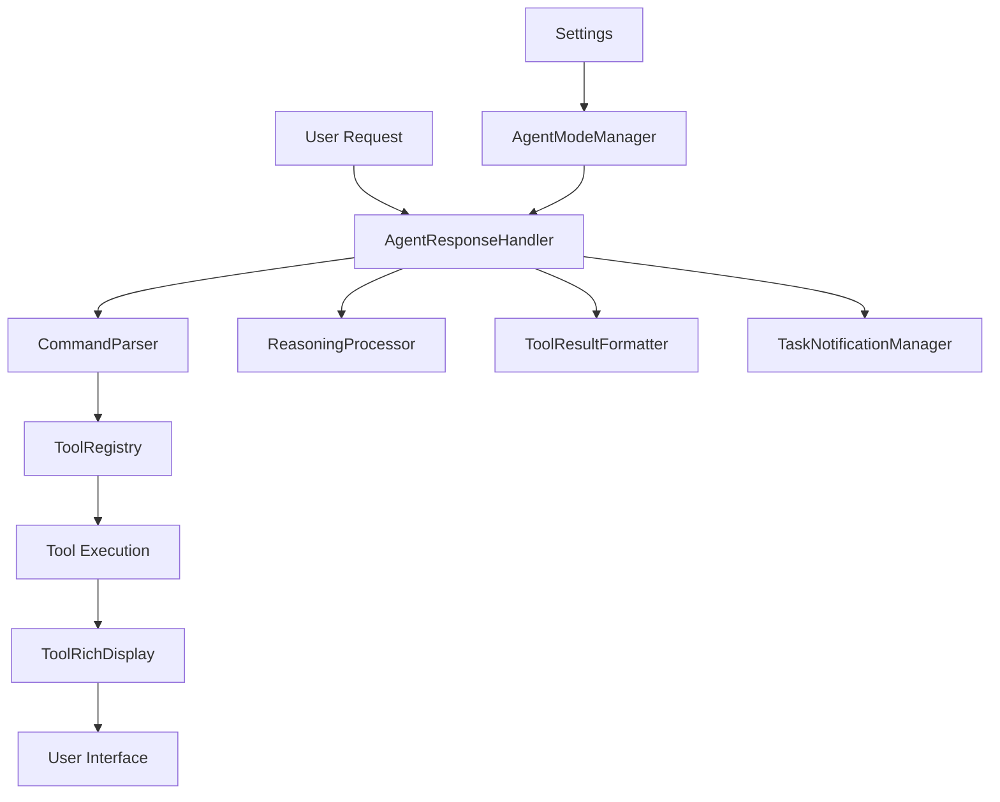

# Agent Mode System Analysis - July 26, 2025

**Date:** 2025-07-26  
**AI Call Analyzed:** [`ai-call-2025-07-26T20-30-01-123Z.txt`](../ai-calls/ai-call-2025-07-26T20-30-01-123Z.txt)  
**Analysis Focus:** Broader agent mode system architecture, UX, and performance

## Executive Summary

This document analyzes the AI Assistant for Obsidian plugin's agent mode system based on a specific AI call that demonstrates the `file_diff` tool workflow. The analysis reveals a sophisticated multi-layered architecture with robust tool execution capabilities, comprehensive error handling, and rich user interface components.

## AI Call Overview

The analyzed AI call demonstrates a complete agent mode workflow:

- **Request:** User asks to change "socks" to "pants" in a markdown file
- **AI Response:** Uses `thought` tool for planning, `file_read` for content retrieval, and `file_diff` for suggesting changes
- **Tool Execution:** Successfully executes 3 tools with proper sequencing and result handling
- **Duration:** 1.672 seconds total processing time
- **Model:** OpenAI GPT-4.1 with temperature 0

## System Architecture Analysis

### Core Components



### Key Architecture Layers

#### 1. **Request Processing Layer**
- **[`AgentResponseHandler`](../src/components/agent/AgentResponseHandler/AgentResponseHandler.ts)**: Central orchestrator for agent mode operations
- **[`CommandParser`](../src/components/agent/CommandParser.ts)**: Extracts and validates tool commands from AI responses
- **[`AgentModeManager`](../src/components/agent/agentModeManager.ts)**: Manages agent mode settings and state

#### 2. **Tool Execution Layer**
- **[`ToolRegistry`](../src/components/agent/ToolRegistry.ts)**: Manages tool registration and execution
- **[`ToolExecutor`](../src/components/agent/AgentResponseHandler/ToolExecutor.ts)**: Handles tool execution with timeout and error management
- **Individual Tools**: Specialized implementations like [`FileDiffTool`](../src/components/agent/tools/FileDiffTool.ts)

#### 3. **Result Processing Layer**
- **[`ReasoningProcessor`](../src/components/agent/AgentResponseHandler/ReasoningProcessor.ts)**: Processes reasoning data from tool results
- **[`ToolResultFormatter`](../src/components/agent/AgentResponseHandler/ToolResultFormatter.ts)**: Formats tool results for display
- **[`TaskNotificationManager`](../src/components/agent/AgentResponseHandler/TaskNotificationManager.ts)**: Manages task progress notifications

#### 4. **User Interface Layer**
- **[`ToolRichDisplay`](../src/components/agent/ToolRichDisplay.ts)**: Rich UI components for tool result visualization
- **[`MessageRenderer`](../src/components/agent/MessageRenderer.ts)**: Renders chat messages with tool integration
- **[`ToolLimitWarningUI`](../src/components/agent/AgentResponseHandler/ToolLimitWarningUI.ts)**: Manages execution limit warnings

## Tool Execution Pipeline

### 1. Request Initiation
```typescript
// From ai-call-2025-07-26T20-30-01-123Z.txt lines 18-19
{
  "role": "user",
  "content": "testing diff, please change to pants please"
}
```

### 2. AI Response Processing
The AI generates a structured response with tool commands:
```json
{
  "action": "file_diff",
  "parameters": {
    "path": "Engaging Tweets.md",
    "originalContent": "...",
    "suggestedContent": "...",
    "insertPosition": 0
  },
  "requestId": "diff1"
}
```

### 3. Tool Execution Sequence
Based on the system message analysis, the execution follows this pattern:

1. **Thought Tool** - Planning and reasoning
2. **File Read Tool** - Content retrieval
3. **File Diff Tool** - Change suggestion generation

### 4. Result Processing and Display
- Tool results are formatted and cached
- Rich UI displays are created for each tool execution
- Results are integrated into the chat interface

## Code Implementation Analysis

### Agent Response Handler Architecture

The [`AgentResponseHandler`](../src/components/agent/AgentResponseHandler/AgentResponseHandler.ts) serves as the central orchestrator with several key responsibilities:

**Core Processing Method:**
```typescript
async processResponse(response: string, contextLabel?: string): Promise<{
    processedText: string;
    toolResults: Array<{ command: ToolCommand; result: ToolResult }>;
    hasTools: boolean;
}>
```

**Key Features:**
- Tool execution limit management (configurable via settings)
- Caching mechanism for tool displays and markdown
- Error handling with graceful degradation
- Support for user feedback tools with async handling

### Tool Registry System

The [`ToolRegistry`](../src/components/agent/ToolRegistry.ts) provides:
- Dynamic tool registration and discovery
- Context injection for tools requiring special parameters
- Execution isolation and error containment

### Settings Integration

Agent mode is deeply integrated with the plugin's settings system via [`AgentSettingsSection`](../src/settings/sections/AgentSettingsSection.ts):

- **Configurable Parameters:**
  - Max tool calls per conversation (1-50)
  - Tool execution timeout (5-300 seconds)
  - Max iterations per task (1-20)
  - Individual tool enable/disable toggles
  - Custom system message templates

## Performance Characteristics

### Execution Metrics (from analyzed call)
- **Total Duration:** 1.672 seconds
- **Tool Count:** 3 tools executed
- **Response Size:** ~350 bytes file content
- **Memory Efficiency:** Tool displays cached for reuse

### Optimization Features
- **Caching:** Tool markdown outputs cached to prevent regeneration
- **Lazy Loading:** Tool instances created on-demand
- **Timeout Management:** Configurable timeouts prevent hanging operations
- **Circuit Breaker Pattern:** Execution limits prevent runaway tool usage

## User Experience Analysis

### Strengths
1. **Rich Visual Feedback:** Tool executions displayed with icons, status indicators, and formatted results
2. **Interactive Elements:** Copy, rerun, and expand/collapse functionality for tool results
3. **Progress Tracking:** Clear indication of tool execution count and limits
4. **Error Handling:** Graceful error display with actionable feedback

### User Interface Components

**Tool Display Features:**
- Status icons (✅ success, ❌ error, ⏳ pending)
- Collapsible content sections
- Copy-to-clipboard functionality
- Rerun capability for failed tools
- Markdown formatting for results

**Limit Management UI:**
- Warning displays when approaching limits
- Options to extend limits or reset counters
- Settings integration for permanent adjustments

## Security and Safety Features

### Execution Controls
- **Tool Limits:** Configurable maximum executions per conversation
- **Timeout Protection:** Prevents infinite-running tools
- **Validation:** Path validation and parameter sanitization
- **User Confirmation:** File diff tool requires user approval for changes

### Error Containment
- Tool execution errors don't crash the system
- Graceful fallback for missing dependencies
- Debug logging for troubleshooting

## Recommendations for Improvement

### 1. Performance Enhancements

#### Async Tool Execution Pipeline
**Current State:** Tools execute sequentially  
**Recommendation:** Implement parallel execution for independent tools

```typescript
// Proposed enhancement
async executeToolsInParallel(independentTools: ToolCommand[]): Promise<ToolResult[]> {
    return Promise.allSettled(
        independentTools.map(tool => this.executeWithTimeout(tool))
    );
}
```

**Benefits:**
- Reduced total execution time
- Better resource utilization
- Improved user experience for multi-tool operations

#### Tool Result Streaming
**Current State:** Results displayed after completion  
**Recommendation:** Stream partial results for long-running tools

**Benefits:**
- Real-time feedback for users
- Better perceived performance
- Early error detection

### 2. User Experience Improvements

#### Enhanced Tool Visualization
**Current State:** Basic status icons and text display  
**Recommendation:** Rich progress indicators and result previews

**Proposed Features:**
- Progress bars for file operations
- Live diff previews
- Syntax highlighting for code results
- Thumbnail previews for image operations

#### Intelligent Tool Suggestions
**Current State:** AI decides which tools to use  
**Recommendation:** Proactive tool suggestions based on context

```typescript
interface ToolSuggestion {
    tool: string;
    confidence: number;
    reason: string;
    parameters?: Partial<ToolCommand['parameters']>;
}
```

#### Workflow Templates
**Current State:** Each interaction starts fresh  
**Recommendation:** Predefined workflows for common tasks

**Examples:**
- "Blog Post Creation" (file_write → file_read → file_diff)
- "Code Review" (file_search → file_read → file_diff)
- "Documentation Update" (file_search → file_read → file_write)

### 3. Architecture Improvements

#### Plugin Architecture Modernization
**Current State:** Monolithic tool registry  
**Recommendation:** Modular plugin system for tools

```typescript
interface ToolPlugin {
    name: string;
    version: string;
    dependencies: string[];
    install(): Promise<void>;
    uninstall(): Promise<void>;
    getTool(): Tool;
}
```

**Benefits:**
- Third-party tool development
- Better maintainability
- Reduced bundle size
- Dynamic tool loading

#### State Management Enhancement
**Current State:** Local state in AgentResponseHandler  
**Recommendation:** Centralized state management

```typescript
interface AgentState {
    executionHistory: ToolExecution[];
    activeWorkflows: Workflow[];
    userPreferences: UserPreferences;
    toolMetrics: ToolMetrics;
}
```

#### Event-Driven Architecture
**Current State:** Direct method calls between components  
**Recommendation:** Event bus for loose coupling

**Benefits:**
- Better testability
- Easier feature addition
- Improved debugging capabilities

### 4. Developer Experience Improvements

#### Tool Development Kit
**Current State:** Manual tool implementation  
**Recommendation:** Standardized SDK for tool creation

```typescript
class ToolBuilder {
    static create(name: string): ToolBuilder;
    withDescription(desc: string): ToolBuilder;
    withParameter(name: string, type: string, required: boolean): ToolBuilder;
    withExecutor(fn: ToolExecutor): ToolBuilder;
    build(): Tool;
}
```

#### Enhanced Debugging
**Current State:** Basic debug logging  
**Recommendation:** Comprehensive debugging tools

**Features:**
- Tool execution timeline visualization
- Parameter inspection tools
- Performance profiling
- Error tracking and analytics

### 5. Integration Enhancements

#### External Tool Integration
**Current State:** Built-in tools only  
**Recommendation:** Support for external tool APIs

**Examples:**
- GitHub API integration
- Database query tools
- Cloud service connectors
- AI model integrations

#### Workflow Automation
**Current State:** Manual tool execution  
**Recommendation:** Automated workflow triggers

```typescript
interface WorkflowTrigger {
    event: string;
    condition: (context: any) => boolean;
    workflow: ToolCommand[];
}
```

## Implementation Priority Matrix

| Enhancement | Impact | Effort | Priority |
|-------------|--------|--------|----------|
| Async Tool Execution | High | Medium | High |
| Enhanced Tool Visualization | High | Low | High |
| Tool Development Kit | Medium | High | Medium |
| Workflow Templates | Medium | Medium | Medium |
| External Tool Integration | High | High | Low |
| State Management Enhancement | Medium | High | Low |

## Conclusion

The AI Assistant for Obsidian plugin demonstrates a well-architected agent mode system with robust tool execution capabilities. The analyzed AI call showcases effective coordination between multiple system components, from request parsing through tool execution to result display.

The current implementation provides a solid foundation with room for significant enhancements in performance, user experience, and developer productivity. The recommended improvements focus on modernizing the architecture while maintaining the system's reliability and ease of use.

Key strengths include the modular design, comprehensive error handling, and rich user interface components. The main opportunities lie in performance optimization, enhanced visualization, and expanded integration capabilities.

---

**Analysis Date:** July 26, 2025  
**Document Version:** 1.0  
**Next Review:** Recommended after implementation of high-priority enhancements